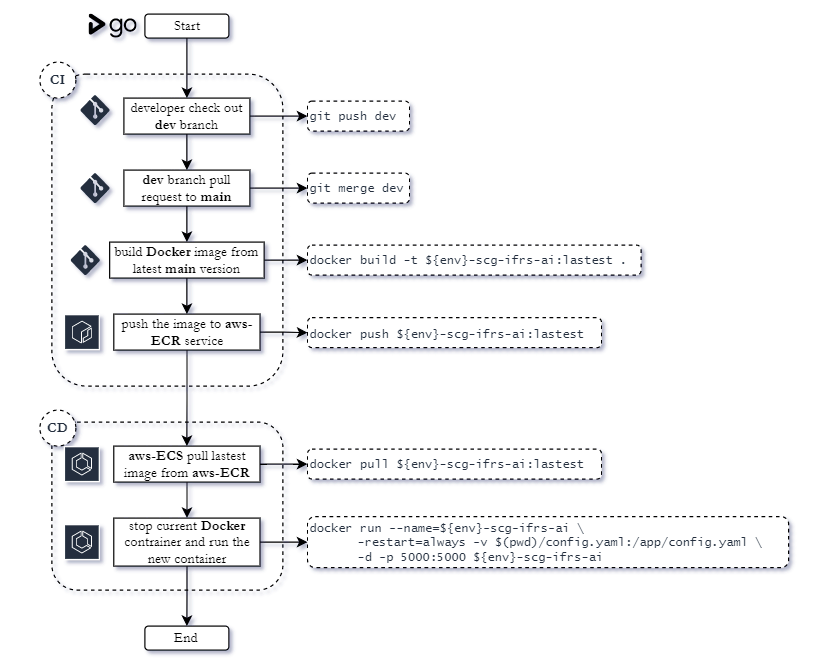

Data Application Framework: *Flask and Postgres*
================================================

This is the RestAPI Data Application Framework that was built by [Flask](https://flask.palletsprojects.com/en/2.0.x/)
and does not use any vendor data framework extension.
So this application framework is easy to enhance, fix, and deploy on different environment because it [less dependencies](requirements.txt)
and lightweight of coding which mean you can remove some components of this framework before deployment.

First objective of this framework is data pipeline orchestration in the retail platform, but the core engine
of this framework can do more than run and monitor data pipeline by requested or scheduler.

This application framework runs on Docker container with AWS ECS service and was requested from AWS Batch or the Platform Web server
via AWS load balancing service. After that, it will generate and deliver SQL statements to be performed in the AWS RDS,
PostgreSQL database, for run a data pipeline.

The AWS ECS service is the host for application framework orchestration, so the overhead of resources for running any transformation in data
pipeline is using only the database engine, but the part of DataFrame transformation use CPU bound (This application framework already implement this function).

### Short Topics:

- [Application Framework](#application-framework)
- [Building](#build-application-framework)
- [API Document](#api-document)
- [CI/CD Flow](#application-cicd-flow)
- [Service Reference](#service-reference)

---

Application Framework
---------------------

  - **Web**

    The Web Application framework. This session will show UI for controller any the framework components.

    > - **pipeline**
    > - **catalog**
    > - **table**
    > - **administration**
    
    This Web use HTMX, Ajax.
    

  - **RestAPI**
    
    The RestAPI Application framework have 3 components that are *analytic*, *ingestion*, and *framework*.
    The framework component is the core of this application that have 3 main modules are,
    
    > - **run data setup**
    > 
    >   Setup all tables that config in the control pipeline table to database and initialize data if set initial
    >   key in catalog file.
    > 
    > - **run data normal**
    >
    >   Transformation or preparation process.
    >      - *common mode* ( process with incremental tracking )
    >      - *rerun mode* ( process without incremental tracking )
    > 
    > - **run data retention**
    >
    >   Retention data to all tables in database that config retention value more than 0. This module contains
    >   backup process, which mean a dumping data from current schema to the backup schema.

Before start this application, the needed environment parameters are,

```yaml
APIKEY: For request API to application
DB_HOST: host of database
DB_NAME: database name
DB_USER: database user
DB_PASS: database password
DB_PORT: database port
AI_SCHEMA: AI schema name
MAIN_SCHEMA: The platform schema name
```

and the needed [python dependencies](requirements.txt) are,

```text
Flask==2.0.2
flask_apscheduler==1.12.3
numpy==1.21.5
pandas==1.3.5
psycopg2-binary==2.9.1
python_dateutil==2.8.2
pytz==2021.3
PyYAML==6.0
requests==2.26.0
sshtunnel==0.4.0
sqlalchemy==1.4.32
yaml==0.2.5
python-dateutil==2.8.2
markupsafe==2.1.1
click==8.1.3
```

```text
# Optional for vendor plug-in function
prophet==1.0.1
statsmodels==0.13.1
scipy==1.7.3
scikit-learn==1.0.2
```

> **Note**:\
> the`requirements.pre.txt` were created because the installation of `prophet` library issue.

---

Build Application Framework
---------------------------

There are 2 ways to build application with input parameters.
If both types were created at the same time, the application
inherits from `environment parameter` first.

  - ### Built with setting `environment variables` in local
    
    __*command line*__
    
    - *Docker image*
    
    ```shell
    sudo docker build -t ${env}-application .
    sudo docker images
    # REPOSITORY          TAG        IMAGE ID       CREATED          ...
    # ${env}-application  latest     b50e8cdd83ed   10 seconds ago   ...
    ```
    
    - *Docker container*
    
    ```shell
    mkdir -p log
    sudo docker run --${env}-application \
    -e APIKEY='<api-key-in-env>' \
    -e DB_HOST='<host>' \
    -e DB_NAME='<database-name>' \
    -e DB_USER='<user>' \
    -e DB_PASS='<password>' \
    -e DB_PORT='5432' \
    -e AI_SCHEMA='ai' \
    -e MAIN_SCHEMA='public' \
    --restart=always -d -p 5000:5000 ${env}-application
    sudo docker ps
    # CONTAINER ID      IMAGE               COMMAND                   CREATED         ...
    # 873eca95a051      ${env}-application  "python ./manage.py run"  10 seconds ago  ...
    ```

  - ### Built with the `.env` file

    set environment variables in *[.env](.env.%7Bdemo%7D)* file.
    ```yaml
    # Main Configurations
    APIKEY: "<api-key-in-env>"
    DB_HOST: "<host>"
    DB_NAME: "<database-name>"
    DB_USER: "<user>"
    DB_PASS: "<password>"
    DB_PORT: "5432"
    AI_SCHEMA: "ai"
    MAIN_SCHEMA: "public"
    
    # Optional for SSH Tunnel to Private Database in Local Machine
    SSH_FLAG: "True"
    SSH_HOST: "<host>"
    SSH_USER: "<user>"
    SSH_PRIVATE_KEY: "<`.pem` file in ./conf>"
    SSH_PORT: "22"
    ```
    __*command line*__
    
    - *Docker image*
    ```shell
    sudo docker build -t ${env}-application .
    sudo docker images
    # REPOSITORY          TAG        IMAGE ID       CREATED          ...
    # ${env}-application  latest     b50e8cdd83ed   10 seconds ago   ...
    ```
    
    - *Docker container*
    ```shell
    mkdir -p log
    sudo docker run --name=${env}-application --restart=always \
    -v $(pwd)/.env:/app/.env \
    --restart=always -d -p 5000:5000 ${env}-application
    sudo docker ps
    # CONTAINER ID      IMAGE               COMMAND                   CREATED         ...
    # 873eca95a051      ${env}-application  "python ./manage.py run"  10 seconds ago  ...
    ```

> **Note**:\
> Other way to run this application in local is the Docker Compose with docker-compose.yml file

---

API Document
------------

The first thing you should do after running this application is to perform an API health checking with
below the curl command,

*without `APIKEY`*
```shell
curl --location --request GET 'http://localhost:5000/api'
# {'message': "Success: Application was running ..."}
```

*or included `APIKEY`*
```shell
curl --location --request GET 'http://localhost:5000/apikey' \
--header 'APIKEY: <api-key-in-env>'
# {"message": "Success: Connect with the apikey, the application was running ..."}
```
- if `APIKEY` does not match with config,
```json
{ "message": "Error: Unauthorised with 'APIKEY'" }
```

[More details of API document](doc/README.md)

---

Application CI/CD Flow
----------------------

This application framework use [GoCD](https://www.gocd.org/) for create CI/CD pipeline
to deploy with difference environments (like dev, sit, or prod)
when the source code in this main repository was merged.

### GoCD Pipeline

In the GoCD pipeline, it has 3 steps on deployment agent,

> 1) build-container-image
> 2) push-to-registry
> 3) deploy-to-ECS




The skeleton directories in the application

```text
flask-rds-data-engine
├─── application
│    ├─── components
│    │    ├─── api
│    │    │    ├─── analytic
│    │    │    │    ├─── __init__.py
│    │    │    │    ├─── tasks.py
│    │    │    │    └─── views.py
│    │    │    ├─── framework
│    │    │    │    ├─── __init__.py
│    │    │    │    ├─── forms.py
│    │    │    │    ├─── tasks.py
│    │    │    │    └─── views.py
│    │    │    ├─── ingestion
│    │    │    │    ├─── __init__.py
│    │    │    │    ├─── forms.py
│    │    │    │    ├─── tasks.py
│    │    │    │    └─── views.py
│    │    │    └─── __init__.py
│    │    ├─── controllers
│    │    │    ├─── admin
│    │    │    ├─── errors
│    │    │    ├─── users
│    │    │    └─── __init__.py
│    │    ├─── frontend
│    │    │    ├─── __init__.py
│    │    │    ├─── models.py
│    │    │    └─── views.py
│    │    └─── __init__.py
│    ├─── test
│    │    ├─── test_utils
│    │    │    ├─── test_base.py
│    │    │    └─── test_config.py
│    │    └─── __init__.py
│    ├─── utils
│    │    ├─── __init__.py
│    │    ├─── base.py
│    │    ├─── config.py
│    │    ├─── convertor.py
│    │    ├─── database.py
│    │    ├─── io.py
│    │    ├─── logging_.py
│    │    ├─── models.py
│    │    ├─── objects.py
│    │    ├─── reusable.py
│    │    ├─── thread_.py
│    │    └─── validations.py
│    ├─── vendor
│    │    ├─── __init__.py
│    │    ├─── forecast.py
│    │    └─── replenishment.py
│    ├─── __init__.py
│    ├─── app.py
│    ├─── assets.py
│    ├─── constants.py
│    ├─── controls.py
│    ├─── errors.py
│    ├─── extensions.py
│    ├─── infrastructures.py
│    ├─── schedules.py
│    └─── securities.md
├─── conf
│    ├─── adhoc
│    │    ├─── <query-name>.yaml
│    │    └─── ...
│    ├─── catalog
│    │    ├─── <config-name>.yaml
│    │    └─── ...
│    ├─── function
│    │    ├─── <function-name>.yaml
│    │    └─── ...
│    ├─── pipeline
│    │    ├─── <pipeline-name>.yaml
│    │    └─── ...
│    ├─── view
│    │    ├─── <view-name>.yaml
│    │    └─── ...
│    └─── README.md
├─── data
│    └─── initial
│         ├─── <table-name>
│         └─── ...
├─── doc
│    ├─── image
│    ├─── <document-file>.md
│    ├─── ...
│    └─── README.md
├─── .env
├─── .gitattributes
├─── .gitignore
├─── CHANGES.md
├─── Dockerfile
├─── LICENSE.md
├─── README.md
├─── REFERENCES.md
├─── requirements.pre.txt
├─── requirements.txt
└─── manage.py
```

---

Service Reference
-----------------

- AWS
  - ~~AWS EC2~~
    - virtual machine / virtual server
    - `python version 3.8`
  - AWS RDS (PostgreSQL)
    - database service: `postgrest version 12.6`
  - AWS ECR
    - image service for keep application image
  - AWS ECS
    - container service for running application
  - AWS Systems Manager
    - use Parameter Store for control secret parameters
    - such as `APIKEY`, `DB_HOST`, ...
  - ~~AWS Athena (additional)~~
    - monitor source files that was uploaded by users
    - config AWS Glue catalog and sync catalog to dataset in AWS Athena
  - AWS Cloudwatch (additional)
    - monitor logging of AWS ECS
  - ~~AWS Lambda (additional)~~
    - create export task for generate dashboard data for platform
  - ~~AWS Glue~~
- GoCD
  - for create CI/CD pipeline with difference environments
- GitHub
  - code repository
- Confluence
  - project document for deliver to customer
- Jira
  - project timeline planning and task assignment
- Slack
  - meeting and communication with team
  - ~~alert error log from AWS ECS~~

---

License
-------

This project was licensed under the terms of the [MIT license](LICENSE.md).
