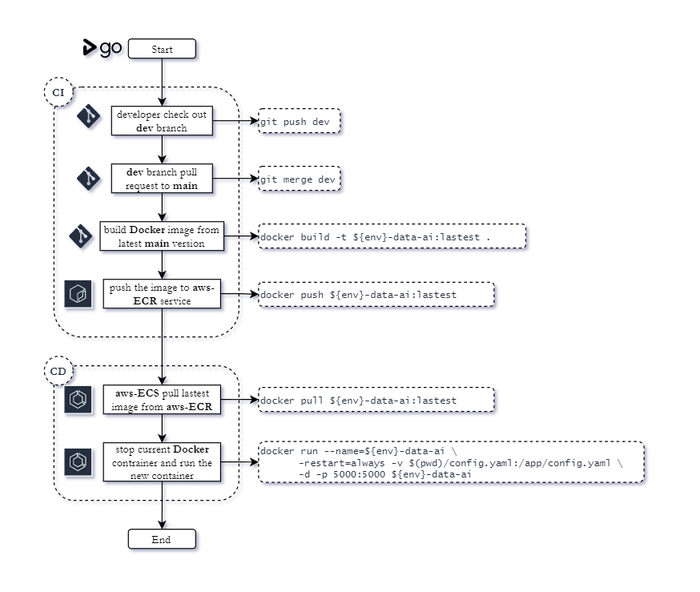

# Data Framework Application: *Flask and Postgres*

**Table of Contents**:

* [Overviews](#overviews)
  * [Getting Started](#getting-started)
  * [Components](#components)
* [Build Application](#build-application)
* [API Document](#api-document)
* [CI/CD Flow](#application-cicd-flow)
* [Service Reference](#service-reference)

This is the Full-Stack **Data Framework Application** (DFA) that was built by 
[Flask Micro-Web Application Framework](https://flask.palletsprojects.com/en/2.0.x/)
and does not use any 3th-party of data orchestration or data framework like; 
[Airflow](https://airflow.apache.org/), [Dagster](https://dagster.io/),
[Prefect](https://www.prefect.io/), or [Airbyte](https://airbyte.com/).
Then it was making this framework application is easy to enhance, fix, and deploy
on different environments or systems. It has [fewer dependencies](requirements.txt),
less complex code, and lightweight of coding which mean you can remove some components
of this framework before deploy without error or with debuggable error.

First objective of this framework application is data pipeline orchestration in
a retail platform, but the core engine of this application framework can do more
than orchestrate data pipeline by requested or scheduler.

## Overviews

This application framework able to run on **Docker** container service like **AWS ECS**,
and it was requested from **AWS Batch** or any Platform Web server via **AWS Load Balancing**.
After that, it will generate and deliver SQL statements to be performed in the
**AWS RDS**, or **PostgresSQL**, for run a data pipeline.

The **AWS ECS** service is the host for this framework application orchestration,
so the overhead of resources for running any transformation in data pipeline is
using only the database engine, but the part of DataFrame transformation which
use CPU bound this framework application can handle this purpose
(This application framework already implement this function).

### Getting Started

Before start this application, the needed environment parameters are,

```yaml
APIKEY: For request API to application
DB_HOST: host of database
DB_NAME: database name
DB_USER: database user
DB_PASS: database password
DB_PORT: database port
AI_SCHEMA: AI schema name
MAIN_SCHEMA: The platform schema name
```

and the needed [python dependencies](requirements.txt). If you want to install it,
you can use:

```shell
# Optional for vendor function.
pip install --no-cache-dir -r requirements.pre.txt

# Main requirement package of this application.
pip install --no-cache-dir -r requirements.txt
```

After setup environment variables and dependencies, we can run by this command:

```shell
python .\manage.py run --help
```

For the first time, you should create all tables to database:

```shell
python .\manage.py run --api --debug --recreated
```

### Components

**This data application framework has 2 functional components**:

- [Web Service Component](#web-service)
- [RestAPI Service Component](#restapi-service)

#### Web Service

The Web Application framework serve static templates to client. This session will
show UI for control any framework components.

- Pipeline
- Catalog
- Table
- Admin 

> [!NOTE]
> This Web App use **HTMX**, and **Ajax** for sync data from server.

#### RestAPI Service
    
The RestAPI service has 3 subcomponents are *analytic*, *ingestion*, and *framework* component.
For the *framework* component is the core of this application framework that have
3 modules are,

- Setup
- Run Data
- Retention

**Setup**: all tables that config in the control pipeline table to database and initialize data if set initial
key in catalog file.

**Run Data**: transformation or preparation process.
- *common mode* ( process with incremental tracking )
- *rerun mode* ( process without incremental tracking )

**Retention**: data to all tables in database that config retention value more than 0.
This module contains backup process, which mean a dumping data from current schema to the backup schema.

## Build Application

There are 3 ways to build application with input parameters. If both types were 
created at the same time, the application inherits from `environment parameter` 
first.

- [Built with setting `environment variables` in local]()
- [Built with the `.env` file]()
- [Built with Docker Compose]()

### Built with setting `environment variables` in local
     
*Docker image*:

```shell
sudo docker build -t ${env}-application .
sudo docker images
# REPOSITORY          TAG        IMAGE ID       CREATED          ...
# ${env}-application  latest     b50e8cdd83ed   10 seconds ago   ...
 ```

*Docker container*:
  
```shell
$ mkdir -p log
$ export env="development"

$ sudo docker run --${env}-application \
  -e APIKEY='<api-key-in-env>' \
  -e DB_HOST='<host>' \
  -e DB_NAME='<database-name>' \
  -e DB_USER='<user>' \
  -e DB_PASS='<password>' \
  -e DB_PORT='5432' \
  -e AI_SCHEMA='ai' \
  -e MAIN_SCHEMA='public' \
  -e APP_ENV=${env} \
  --restart=always -d -p 5000:5000 ${env}-application

$ sudo docker ps
# CONTAINER ID      IMAGE               COMMAND                   CREATED         ...
# 873eca95a051      ${env}-application  "python ./manage.py run"  10 seconds ago  ...
```

### Built with the `.env` file

set environment variables in *[.env](.env.%7Bdemo%7D)* file.

```yaml
# Main Configurations
APIKEY: "<api-key-in-env>"
DB_HOST: "<host>"
DB_NAME: "<database-name>"
DB_USER: "<user>"
DB_PASS: "<password>"
DB_PORT: "5432"
AI_SCHEMA: "ai"
MAIN_SCHEMA: "public"

# Optional for SSH Tunnel to Private Database in Local Machine
SSH_FLAG: "True"
SSH_HOST: "<host>"
SSH_USER: "<user>"
SSH_PRIVATE_KEY: "<`.pem` file in ./conf>"
SSH_PORT: "22"
```

*Docker image*:

```shell
$ export env = "development"
$ sudo docker build -t ${env}-application .
$ sudo docker images
# REPOSITORY          TAG        IMAGE ID       CREATED          ...
# ${env}-application  latest     b50e8cdd83ed   10 seconds ago   ...
```

*Docker container*:

```shell
$ mkdir -p log
$ sudo docker run --name=${env}-application --restart=always \
  -v $(pwd)/.env:/app/.env \
  --restart=always -d -p 5000:5000 ${env}-application
$ sudo docker ps
# CONTAINER ID      IMAGE               COMMAND                   CREATED         ...
# 873eca95a051      ${env}-application  "python ./manage.py run"  10 seconds ago  ...
```

### Built with Docker Compose

Start Docker Compose: 

```shell
docker-compose  -f .\docker-compose.pg.yml up -d --build --force-recreate
```

Clear all Docker Compose component:

```shell
$ docker-compose -f .\docker-compose.pg.yml down --rmi all --volumes
Stopping postgres ... done
Removing postgres ... done
Removing network flask-rds-data-engine_backend-network
Removing volume flask-rds-data-engine_pgdata
Removing image postgres:latest 
```

## API Document

The first thing you should do after running this application is to perform an API
health checking with below the curl command,

*Without `APIKEY`*:

```shell
$ curl --location --request GET 'http://127.0.0.1:5000/api'
{'message': "Success: Application was running ..."}
```

*Included `APIKEY`*:
```shell
$ curl --location --request GET 'http://127.0.0.1:5000/apikey' \
  --header 'APIKEY: <api-key-in-env>'
{"message": "Success: Connect with the apikey, the application was running ..."}
```
> **Note**: \
> If the `APIKEY` does not match with the application config, it will respond with
> `{ "message": "Error: Unauthorised with 'APIKEY'" }`.

Read more information, [API documents](docs/README.md)

## Application CI/CD Flow

This application framework use [GoCD](https://www.gocd.org/) for create CI/CD pipeline
to deploy with difference environments (like dev, sit, or prod)
when the source code in this main repository was merged.

In the GoCD pipeline, it has 3 steps on the CI/CD pipeline,

1) Build container image
2) Push the image to GoCD image registry
3) Deploy the image from registry to ECS



## Service Reference

- AWS
  - ~~AWS EC2~~
    - virtual machine / virtual server
    - `python version 3.8`
  - AWS RDS (PostgreSQL)
    - database service: `postgrest version 12.6`
  - AWS ECR
    - image service for keep application image
  - AWS ECS
    - container service for running application
  - AWS Systems Manager
    - use Parameter Store for control secret parameters
    - such as `APIKEY`, `DB_HOST`, ...
  - ~~AWS Athena (additional)~~
    - monitor source files that was uploaded by users
    - config AWS Glue catalog and sync catalog to dataset in AWS Athena
  - AWS Cloudwatch (additional)
    - monitor logging of AWS ECS
  - ~~AWS Lambda (additional)~~
    - create export task for generate dashboard data for platform
  - ~~AWS Glue~~
- GoCD
  - for create CI/CD pipeline with difference environments
- GitHub
  - code repository
- Confluence
  - project document for deliver to customer
- Jira
  - project timeline planning and task assignment
- Slack
  - meeting and communication with team
  - ~~alert error log from AWS ECS~~

## License

This project was licensed under the terms of the [MIT license](LICENSE.md).
