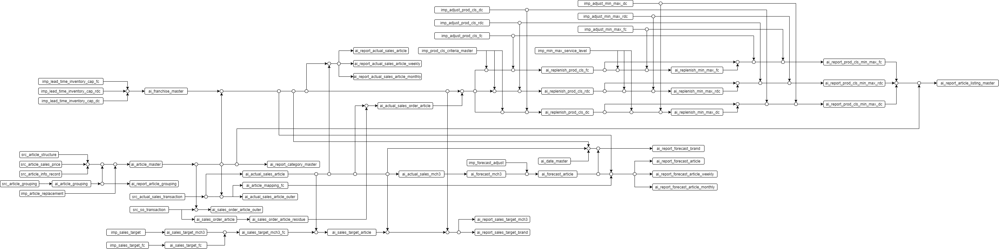

# Document

> Document topics:
> - [Data Pipeline](#data-pipeline)
> - [Framework Standard](#framework-standard)
> - [Framework Operation](#framework-operation)
> - [Framework Schedule](#framework-schedule)
> - [API Document](#api-document)

Data Pipeline
-------------




Framework Standard
------------------

### Parameter and Naming Setup

- #### Prefix of table name

| Table Prefix | Description | System mapping |
| --- | --- | --- | 
| `ctr_` | framework control table for data pipeline process | internal |
| `src_` | data source that landing from S3 | external |
| `imp_` | implement data that ingest from platform | external |
| `ai_` | aggregate data in AI module | internal |
| `ai_report_` | report data | internal |

- #### System type description

| System Type | Description/Action |  
| --- | --- |
| `external` | data in table will ingest from _internal_ of AI schema |
| `internal` | data in table will ingest from _external_ of AI schema |

- #### Table type description

| Table Type | Description/Action |
| --- | --- |
| `master` | master data and action with data retention module if match with `src_` prefix table and set `primary_key_dummy` |
| `transaction` | transaction data have to run with range `data_date` and `run_date` and important case it mode rerun |
| `report` | report data that run with `run_date` only |
| `adjustment` | adjust data that run with the latest `update_date` |

- #### Data type support

| Data Type | Remark |
| --- | --- |
| varchar( _l_ ) | |
| numeric( _p_, _s_ ) | |
| double precision | |
| integer | |
| smallint | |
| smallserial | |

> **Note:**\
> Warning issue about rounding even number between `numeric` and `double precision`

### Job Process Setup

The job was created by `.yaml` file configuration. 
The pipeline contains multiple job tables, and the job tables contain multiple processes.

```yaml
pipeline-name-01:
     table-name-01:
          - process-name-01
          - process-name-02
          - ...
     table-name-02:
          - process-name-01
          - process-name-02
          - ...
     ...
```

#### Configuration Documents
- [Catalog config document](../conf/README.md)

Framework Operation
-------------------

Process task will be logging to `ctr_task_process` and process table will be logging to `ctr_data_logging` table.

> #### Examples
> - [Run Data Foreground](#_run-data-foreground_)
> - [Run Data Background](#_run-data-background_)


### _Run Data Foreground_

If start run `ai_forecast_mch3` process table on datetime `2021-01-01 12:10:13`

_command_

```shell
$ curl --location --request POST 'http://localhost:5000/api/ai/run/data' \
--header 'APIKEY: <api-key-in-env>' \
--form 'table_name="sql:ai_forecast_mch3"' \
--form 'run_date="2021-01-01"' \
--form 'run_mode="common"' \
--form 'background="N"'
```

- #### Success Case

_response output_

```json
{
  "message": "[ run_date: 2021-01-01 ]\nSuccess: Running 'ai_forecast_mch3' mode 'common' with logging value (52 rows, 2 sec)",
  "process_time": 5
}
```

_data logging result_

| table_name | data_date | update_date | run_date | row_record | process_time | action_type | status |
| --- | --- | --- | --- | --- | --- | --- | --- |
| ai_forecast_mch3 | 2021-02-08 | 2021-01-01 12:10:15 | 2021-01-01 | 52 | 2 | common | 0 |

_task logging result_

| process_id | process_type | process_name_put | process_name_get | run_date_put | run_date_get | update_date | process_message | process_time | process_number_put | process_number_get | process_module | status
| --- | --- | --- | --- | --- | --- | --- | --- | --- | --- | --- | --- | --- |
| 20210101115609927983783624 | foreground&#124;table | ai_forecast_mch3 | `NULL` | 2021-01-01 | `NULL` | 2021-01-01 12:10:15.000 | [ run_date: 2021-01-01 ]&#124;Success: ... | 2 | 1 | 1 | framework&#124;data | 0 |

- #### Process Case

_data logging result_

| table_name | data_date | update_date | run_date | row_record | process_time | action_type | status |
| --- | --- | --- | --- | --- | --- | --- | --- |
| ai_forecast_mch3 | `NULL` | 2021-01-01 12:10:13 | 2021-01-01 | `NULL` | `NULL` | common | 2 |

- #### Fail Case

```json
{
  "message": "[ run_date: 2021-01-01 ]\nError: Please check value of `run_date`, which less than the current control running date: '2021-01-02'",
  "process_time": 3
}
```

_data logging result_

| table_name | data_date | update_date | run_date | row_record | process_time | action_type | status |
| --- | --- | --- | --- | --- | --- | --- | --- |
| ai_forecast_mch3 | `NULL` | 2021-01-01 12:10:16 | 2021-01-01 | 0 | 3 | common | 1 |

_task logging result_

| process_id | process_type | process_name_put | process_name_get | run_date_put | run_date_get | update_date | process_message | process_time | process_number_put | process_number_get | process_module | status
| --- | --- | --- | --- | --- | --- | --- | --- | --- | --- | --- | --- | --- |
| 20210101115609927983783624 | foreground&#124;table | ai_forecast_mch3 | `NULL` | 2021-01-01 | `NULL` | 2021-01-01 12:10:16.000 | [ run_date: 2021-01-01 ]&#124;Error: ... | 3 | 1 | 1 | framework&#124;data | 0 |

### _Run Data Background_

If start run `ai_forecast_mch3` process table on datetime `2021-01-01 12:10:13`

_command_

```shell
$ curl --location --request POST 'http://localhost:5000/api/ai/run/data' \
--header 'APIKEY: <api-key-in-env>' \
--form 'table_name="sql:ai_forecast_mch3"' \
--form 'run_date="2021-01-01"' \
--form 'run_mode="common"' \
--form 'background="Y"'
```

_response output_

```json
{
    "message": "Start running pipeline_name: 'ai_forecast_mch3' in background. Monitoring task should select table 'ctr_task_process' where process_id = '20210101123202454783783624'.",
    "process_id": "20210101123202454783783624"
}
```

- #### Success Case

_task logging result_

| process_id | process_type | process_name_put | process_name_get | run_date_put | run_date_get | update_date | process_message | process_time | process_number_put | process_number_get | process_module | status
| --- | --- | --- | --- | --- | --- | --- | --- | --- | --- | --- | --- | --- |
| 20210101123202454783783624 | background&#124;table | ai_forecast_mch3 | `NULL` | 2021-01-01 | `NULL` | 2021-01-01 12:10:15.000 | [ run_date: 2021-01-01 ]&#124;Success: ... | 3 | 1 | 1 | framework&#124;data | 0 |

- #### Process Case

| process_id | process_type | process_name_put | process_name_get | run_date_put | run_date_get | update_date | process_message | process_time | process_number_put | process_number_get | process_module | status
| --- | --- | --- | --- | --- | --- | --- | --- | --- | --- | --- | --- | --- |
| 20210101123202454783783624 | background&#124;table | ai_forecast_mch3 | ai_forecast_mch3 | 2021-01-01 | 2021-01-01 | 2021-01-01 12:10:13.000 | Start background process ... | 0 | 1 | 1 | framework&#124;data | 2 |

- #### Fail Case

| process_id | process_type | process_name_put | process_name_get | run_date_put | run_date_get | update_date | process_message | process_time | process_number_put | process_number_get | process_module | status
| --- | --- | --- | --- | --- | --- | --- | --- | --- | --- | --- | --- | --- |
| 20210101123202454783783624 | background&#124;table | ai_forecast_mch3 | `NULL` | 2021-01-01 | `NULL` | 2021-01-01 12:10:18.000 | [ run_date: 2021-01-01 ]&#124;Error: ... | 5 | 1 | 1 | framework&#124;data | 1 |

Framework Schedule
------------------

Job schedule in framework existing 3 jobs

- retention data
- re-create table
- check process

API Document
------------

  - [API Scenarios Handler](api_scenarios_handler.md)
  - [API Result Handler](api_result_handler.md)
  - [API Trigger and Schedule](api_trigger_and_schedule.doc)